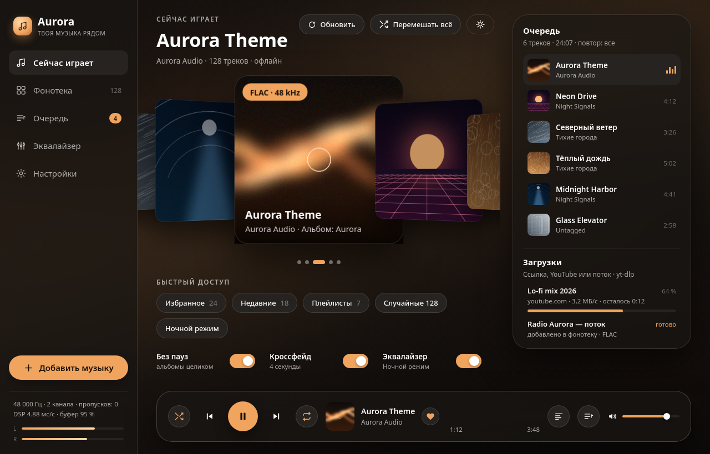
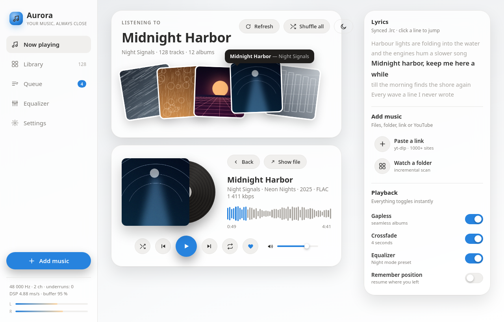

<div align="center">

# Aurora Player

**Современный музыкальный плеер на C++17 — офлайн и онлайн, с загрузкой музыки из файлов, ссылок и YouTube.**\
*A modern C++17 music player — offline and online, with imports from files, links and YouTube.*

[](https://github.com/skaisayyy/aurora-player/actions/workflows/ci.yml)
[](LICENSE)






</div>

---

## Содержание

- [Что это](#что-это)
- [Возможности](#возможности)
- [Установка](#установка)
- [Сборка из исходников](#сборка-из-исходников)
- [Как добавить музыку](#как-добавить-музыку)
- [Горячие клавиши](#горячие-клавиши)
- [Плеер в терминале](#плеер-в-терминале)
- [Производительность](#производительность)
- [Архитектура](#архитектура)
- [English](#english)

---

## Что это

Aurora Player — это не «ещё один плеер на Electron». Это два независимых слоя:

| Слой | Что внутри | Зависимости |
| --- | --- | --- |
| `core/` | звуковой движок, декодеры, фонотека, теги, загрузки, эквалайзер, тексты песен, локализация | только C++17 STL |
| `app/` | интерфейс Qt 6 Quick: cover-flow, винил, стеклянная панель управления | Qt 6.5+ |

Ядро собирается и проходит тесты вообще без Qt, поэтому его можно встроить куда угодно,
а интерфейс — заменить. Вся логика звука живёт в `core/`, интерфейс только показывает данные.

---

## Возможности

### Воспроизведение

- Собственный движок на lock-free кольцевом буфере: отдельный поток декодирования,
  никаких аллокаций и блокировок в аудио-колбэке.
- **Gapless** — переход между треками без щелчков и тишины.
- **Кроссфейд** 0–12 секунд с настройкой на ходу.
- Скорость 0.5×–2.0× без изменения громкости.
- 10-полосный эквалайзер (31 Hz … 16 kHz), 11 пресетов, предусиление ±12 dB.
- Точный seek, повтор (выкл / все / один), перемешивание, очередь с drag-free вставкой «играть далее».
- Индикаторы уровня по каналам, счётчик пропусков буфера и загрузки DSP — видно, что движок здоров.

### Форматы

- Встроенный WAV-декодер (PCM 8/16/24/32-бит, float).
- Через ffmpeg: **MP3, FLAC, AAC/M4A, ALAC, OGG/Vorbis, Opus, WMA, AIFF, WavPack** и интернет-радио
  (HTTP/HTTPS-потоки, `.m3u`).
- Теги: ID3v1/ID3v2, Vorbis comments, MP4-атомы; встроенные обложки, `cover.jpg` рядом с файлом,
  `.lrc` тексты — всё читается без внешних библиотек.

### Фонотека

- Инкрементальное сканирование папок: повторный скан трогает только изменившиеся файлы.
- JSON-индекс, поиск с транслитерацией (`polyarnaya` находит «Полярная»), альбомы, исполнители,
  жанры, избранное, счётчик прослушиваний, недавно добавленное и никогда не слушанное.
- Плейлисты `.m3u` на импорт и на экспорт.

### Разные способы добавить музыку

- Файл или папка (в том числе перетаскиванием в окно).
- Прямая ссылка на аудиофайл.
- **YouTube** и ещё 1000+ сайтов через `yt-dlp` — с прогрессом, скоростью, ETA и отменой.
- Интернет-радио как поток.
- Аргументы командной строки: `aurora-player "track.flac"` — плеер становится обработчиком файлов в системе.

### Интерфейс

- Две темы: тёмная со стеклом и светлая; акцентный цвет вычисляется из обложки текущего трека.
- Cover-flow карусель альбомов, винил, выезжающий из конверта, форма волны вместо скучного слайдера.
- Панели очереди, синхронных текстов (клик по строке — переход на это место) и эквалайзера.
- **Полный русский и английский язык, переключается на ходу, без перезапуска.**
- Управление с клавиатуры и медиа-клавишами, автосохранение позиции и настроек.

---

## Установка

### Вариант 1 — готовая сборка с GitHub

1. Откройте страницу **Releases** репозитория.
2. Скачайте архив для своей системы:

| Система | Файл | Что делать |
| --- | --- | --- |
| Windows 10/11 | `aurora-player-windows-x64.zip` | распаковать и запустить `aurora-player.exe` |
| macOS 12+ | `aurora-player-macos.dmg` | открыть и перетащить в Программы |
| Linux | `aurora-player-linux-x64.tar.gz` | `tar xzf ... && ./bin/aurora-player` |

Всё необходимое из Qt уже внутри архива — ставить Qt отдельно не нужно.

### Вариант 2 — собрать самому (одна команда)

```bash
git clone https://github.com/skaisayyy/aurora-player.git
cd aurora-player
./scripts/build.sh          # Linux / macOS
scripts\build.bat           # Windows
```

Скрипт сам настроит CMake, соберёт в Release, прогонит тесты и напишет, где лежат бинарники.

---

## Сборка из исходников

### Требования

| Компонент | Версия | Обязательно? |
| --- | --- | --- |
| Компилятор C++17 | GCC 9+, Clang 12+, MSVC 2019+ | да |
| CMake | 3.21+ | да |
| Qt | 6.5+ (Quick, QuickControls2, Multimedia) | только для графического интерфейса |
| ffmpeg + ffprobe | любая свежая | для MP3/FLAC/AAC/OGG и потоков |
| yt-dlp | любая свежая | для скачивания с YouTube и прочих сайтов |

`ffmpeg` и `yt-dlp` — внешние программы, а не библиотеки: плеер общается с ними через pipe.
Пути к ним можно указать в настройках; `aurora-cli doctor` покажет, что найдено.

```bash
# Ubuntu / Debian
sudo apt install build-essential cmake ffmpeg yt-dlp \
                 qt6-base-dev qt6-declarative-dev qt6-multimedia-dev

# Fedora
sudo dnf install gcc-c++ cmake ffmpeg yt-dlp qt6-qtbase-devel \
                 qt6-qtdeclarative-devel qt6-qtmultimedia-devel

# macOS (Homebrew)
brew install cmake qt@6 ffmpeg yt-dlp

# Windows (winget + Qt Online Installer)
winget install Kitware.CMake Gyan.FFmpeg yt-dlp.yt-dlp
```

### Ручная сборка

```bash
cmake -S . -B build -DCMAKE_BUILD_TYPE=Release
cmake --build build --parallel
ctest --test-dir build --output-on-failure
./build/bin/aurora-player
```

Готовые пресеты: `cmake --preset release`, `--preset debug`, `--preset core-only`.
Нет Qt? `cmake -S . -B build -DAURORA_BUILD_GUI=OFF` — соберутся ядро, терминальный плеер и тесты.

Есть и «аварийный» путь без CMake — обычный `Makefile` в корне:

```bash
make -j        # ядро + aurora-cli + тесты
make test      # 308 проверок
make run       # демонстрация в терминале
```

---

## Как добавить музыку

1. Кнопка **«Добавить музыку»** в боковой панели (или `Ctrl+O`):
   - **Файлы** — один или много треков;
   - **Папка** — добавляется в список наблюдаемых и сканируется;
   - **Ссылка** — прямой аудиофайл, радиопоток или страница YouTube.
2. **Перетащите** файлы, папки или ссылку прямо в окно.
3. Из терминала: `aurora-cli add "https://youtu.be/..."` или `aurora-cli scan ~/Music`.

Ссылка YouTube распознаётся автоматически: включается `yt-dlp`, звук сохраняется в папку загрузок,
теги и обложка читаются сразу после загрузки, трек попадает в фонотеку. Скачанное остаётся
на диске и работает **полностью офлайн**.

---

## Горячие клавиши

| Клавиша | Действие |
| --- | --- |
| `Space` / `Media Play` | играть или пауза |
| `←` / `→` | назад или вперёд на 5 секунд |
| `Ctrl+←` / `Ctrl+→` | предыдущий или следующий трек |
| `↑` / `↓` | громкость |
| `M` | без звука |
| `S` | перемешивание |
| `R` | режим повтора |
| `F` | в избранное |
| `L` | текст песни |
| `Q` | очередь |
| `Ctrl+O` | добавить музыку |
| `Ctrl+F` | фонотека и поиск |
| `Ctrl+E` | эквалайзер |
| `Ctrl+T` | светлая или тёмная тема |
| `Ctrl+,` | настройки |
| `Esc` | закрыть панель |

---

## Плеер в терминале

`aurora-cli` — полноценный клиент того же ядра, без Qt. Полезно на сервере и для диагностики.

```bash
aurora-cli doctor                     # есть ли ffmpeg / ffprobe / yt-dlp
aurora-cli scan ~/Music               # сканировать папки
aurora-cli list --limit 20            # что в фонотеке
aurora-cli search ветер              # поиск (работает и транслитом: polyarnaya)
aurora-cli albums                     # альбомы, artists — исполнители
aurora-cli info track.flac            # теги, битрейт, длительность
aurora-cli waveform track.mp3         # форма волны прямо в терминале
aurora-cli eq                         # список пресетов эквалайзера
aurora-cli download "https://youtu.be/..."
aurora-cli play track.mp3 --volume 0.8 --eq "Bass boost" --crossfade 4
aurora-cli demo --seconds 20 --out mix.wav   # офлайн-рендер в WAV
aurora-cli bench track.wav            # скорость декодирования
aurora-cli lang ru                    # язык интерфейса
```

---

## Производительность

Измерено на ядре в Release-сборке, GCC 11.5, 2 ядра, Linux x86-64:

| Метрика | Значение |
| --- | --- |
| Скорость декодирования | **636.8×** реального времени (11 с звука за 0.017 с) |
| Нагрузка DSP | **4.88 мс на секунду звука** — порядка 0.5 % одного ядра |
| Пропуски буфера (underruns) | **0** на 22 с непрерывного рендера с кроссфейдами |
| Заполнение буфера | 95 % (кольцо 32768 кадров, ≈ 0.68 с при 48 kHz) |
| Сканирование фонотеки | 6 файлов за 0.03 с (чтение тегов включено) |
| Юнит-тесты | **308 из 308** за ≈ 0.5 с |

Почему так: в аудио-колбэке нет ни аллокаций, ни мютексов, ни логов — только чтение из
кольцевого буфера и биквадратные фильтры эквалайзера. Формы волны и палитры кэшируются на диске,
сканирование и загрузки живут в фоновых потоках и никогда не блокируют интерфейс.

---

## Архитектура

```
aurora-player/
├─ core/          ядро без Qt (19 модулей): AudioEngine, Decoder, Equalizer,
│                MediaLibrary, TagReader, Lyrics, Downloader, Config, I18n, Controller
├─ app/          Qt Quick: PlayerBridge (C++) + 23 QML-компонента
├─ cli/          aurora-cli — терминальный плеер и диагностика
├─ tests/        308 проверок без внешних фреймворков
├─ i18n/         ru.json / en.json — словари интерфейса
├─ packaging/    иконка, .desktop, Info.plist
└─ .github/      CI для Linux / Windows / macOS и сборка релизов
```

Подробно — в [docs/ARCHITECTURE.md](docs/ARCHITECTURE.md).

Где хранятся данные:

| Система | Настройки и индекс |
| --- | --- |
| Windows | `%APPDATA%\AuroraAudio\Aurora Player\` |
| macOS | `~/Library/Application Support/Aurora Player/` |
| Linux | `~/.config/aurora-player/`, `~/.local/share/aurora-player/` |

Переопределяются переменными `AURORA_CONFIG_DIR`, `AURORA_DATA_DIR`, `AURORA_CACHE_DIR` —
удобно для portable-версии на флешке.

Нет нормального GPU (RDP, виртуалка, старый драйвер)? Запустите с `AURORA_SOFTWARE_RENDER=1`.
Нет звукового устройства? Плеер сам перейдёт в тихий режим и не упадёт.

---

## English

**Aurora Player** is a modern desktop music player written in C++17 with a Qt 6 Quick interface.

- **Playback:** lock-free ring-buffer engine, dedicated decode thread, gapless transitions,
  0-12 s crossfade, 0.5x-2x speed, 10-band equalizer with 11 presets and preamp,
  per-channel level meters, live underrun/DSP telemetry.
- **Formats:** built-in WAV decoder; MP3, FLAC, AAC/M4A, ALAC, OGG, Opus, WMA, AIFF and
  HTTP radio streams through an ffmpeg pipe. Tags (ID3, Vorbis, MP4), embedded covers and
  `.lrc` lyrics are parsed by hand - no third-party tag library.
- **Library:** incremental folder scanning, JSON index, transliteration-aware search
  (`polyarnaya` finds a Cyrillic title), albums, artists, genres, favourites, play counts,
  `.m3u` import and export.
- **Imports:** files, folders, drag and drop, direct links, radio streams and **YouTube plus
  1000+ sites via yt-dlp** with progress, speed, ETA and cancel. Downloads stay on disk and
  play fully offline afterwards.
- **Interface:** dark glass and light themes, accent colour extracted from the current cover,
  cover-flow carousel, vinyl now-playing card, waveform seek bar, queue, synced lyrics with
  click-to-seek, equalizer and settings screens, **full Russian and English localisation
  switchable at runtime**, keyboard and media-key control.

### Quick start

```bash
git clone https://github.com/skaisayyy/aurora-player.git
cd aurora-player
cmake -S . -B build -DCMAKE_BUILD_TYPE=Release
cmake --build build --parallel
ctest --test-dir build --output-on-failure   # 308/308
./build/bin/aurora-player
```

No Qt available? Add `-DAURORA_BUILD_GUI=OFF` and you still get the core library, the
`aurora-cli` terminal player and the full test suite. Prebuilt Windows, macOS and Linux
bundles are attached to every GitHub release.

### Requirements

C++17 compiler, CMake 3.21+, Qt 6.5+ (GUI only), `ffmpeg`/`ffprobe` for compressed formats,
`yt-dlp` for downloads. Run `aurora-cli doctor` to check what was found.

---

## Лицензия / License

MIT — см. [LICENSE](LICENSE). Загружайте только тот контент, на который у вас есть права.

---

## Плеер в терминале

`aurora-cli` — полноценный клиент того же ядра, без Qt. Полезно на сервере и для диагностики.

```bash
aurora-cli doctor                     # есть ли ffmpeg / ffprobe / yt-dlp
aurora-cli scan ~/Music               # сканировать папки
aurora-cli list --limit 20            # что в фонотеке
aurora-cli search ветер              # поиск, работает и транслитом
aurora-cli albums                     # альбомы; artists — исполнители
aurora-cli info track.flac            # теги, битрейт, длительность
aurora-cli waveform track.mp3         # форма волны в терминале
aurora-cli eq                         # список пресетов эквалайзера
aurora-cli download "https://youtu.be/..."
aurora-cli play track.mp3 --volume 0.8 --crossfade 4
aurora-cli demo --seconds 20 --out mix.wav
aurora-cli bench track.wav            # скорость декодирования
aurora-cli lang ru                    # язык интерфейса
```

---

## Производительность

Измерено на ядре в Release-сборке, GCC 11.5, 2 ядра, Linux x86-64:

| Метрика | Значение |
| --- | --- |
| Скорость декодирования | **636.8x** реального времени (11 с звука за 0.017 с) |
| Нагрузка DSP | **4.88 мс на секунду звука**, около 0.5 % одного ядра |
| Пропуски буфера | **0** на 22 с непрерывного рендера с кроссфейдами |
| Заполнение буфера | 95 % (кольцо 32768 кадров, около 0.68 с при 48 kHz) |
| Сканирование фонотеки | 6 файлов за 0.03 с вместе с чтением тегов |
| Юнит-тесты | **308 из 308** за 0.5 с |

Почему так: в аудио-колбэке нет ни аллокаций, ни мютексов, ни логов — только чтение из кольцевого буфера и биквадратные фильтры эквалайзера. Формы волны и палитры кэшируются на диске, а сканирование и загрузки живут в фоновых потоках и не блокируют интерфейс.

---

## Архитектура

```text
aurora-player/
  core/       ядро без Qt (19 модулей): AudioEngine, Decoder, Equalizer,
              MediaLibrary, TagReader, Lyrics, Downloader, Config, I18n, Controller
  app/        Qt Quick: PlayerBridge (C++) + 23 QML-компонента
  cli/        aurora-cli — терминальный плеер и диагностика
  tests/      308 проверок без внешних фреймворков
  i18n/       ru.json и en.json — словари интерфейса
  packaging/  иконка, .desktop, Info.plist
  .github/    CI для Linux, Windows, macOS и сборка релизов
```

Подробно — в [docs/ARCHITECTURE.md](docs/ARCHITECTURE.md).

Где хранятся настройки и индекс фонотеки:

| Система | Путь |
| --- | --- |
| Windows | `%APPDATA%\AuroraAudio\Aurora Player\` |
| macOS | `~/Library/Application Support/Aurora Player/` |
| Linux | `~/.config/aurora-player/` и `~/.local/share/aurora-player/` |

Переопределяются переменными `AURORA_CONFIG_DIR`, `AURORA_DATA_DIR`, `AURORA_CACHE_DIR` — удобно для portable-версии на флешке.

Нет нормального GPU (RDP, виртуалка, старый драйвер)? Запустите с `AURORA_SOFTWARE_RENDER=1`. Нет звукового устройства? Плеер сам перейдёт в тихий режим и не упадёт.

---

## English

**Aurora Player** is a modern desktop music player written in C++17 with a Qt 6 Quick interface.

- **Playback:** lock-free ring-buffer engine, dedicated decode thread, gapless transitions, 0-12 s crossfade, 0.5x-2x speed, 10-band equalizer with 11 presets and preamp, per-channel level meters, live underrun and DSP telemetry.
- **Formats:** built-in WAV decoder; MP3, FLAC, AAC/M4A, ALAC, OGG, Opus, WMA, AIFF and HTTP radio streams through an ffmpeg pipe. Tags (ID3, Vorbis, MP4), embedded covers and `.lrc` lyrics are parsed by hand, with no third-party tag library.
- **Library:** incremental folder scanning, JSON index, transliteration-aware search, albums, artists, genres, favourites, play counts, `.m3u` import and export.
- **Imports:** files, folders, drag and drop, direct links, radio streams and **YouTube plus 1000+ sites via yt-dlp** with progress, speed, ETA and cancel. Downloads stay on disk and play fully offline afterwards.
- **Interface:** dark glass and light themes, accent colour extracted from the current cover, cover-flow carousel, vinyl now-playing card, waveform seek bar, queue, synced lyrics with click-to-seek, equalizer and settings screens, **full Russian and English localisation switchable at runtime**, keyboard and media-key control.

### Quick start

```bash
git clone https://github.com/skaisayyy/aurora-player.git
cd aurora-player
cmake -S . -B build -DCMAKE_BUILD_TYPE=Release
cmake --build build --parallel
ctest --test-dir build --output-on-failure   # 308/308
./build/bin/aurora-player
```

No Qt available? Add `-DAURORA_BUILD_GUI=OFF` and you still get the core library, the `aurora-cli` terminal player and the full test suite. Prebuilt Windows, macOS and Linux bundles are attached to every GitHub release.

### Requirements

C++17 compiler, CMake 3.21+, Qt 6.5+ (GUI only), `ffmpeg` and `ffprobe` for compressed formats, `yt-dlp` for downloads. Run `aurora-cli doctor` to see what was found.

---

## Лицензия / License

MIT — см. [LICENSE](LICENSE). Загружайте только тот контент, на который у вас есть права.

---

## Архитектура

```text
aurora-player/
  core/       ядро без Qt (19 модулей): AudioEngine, Decoder, Equalizer,
              MediaLibrary, TagReader, Lyrics, Downloader, Config, I18n, Controller
  app/        Qt Quick: PlayerBridge (C++) + 23 QML-компонента
  cli/        aurora-cli — терминальный плеер и диагностика
  tests/      308 проверок без внешних фреймворков
  i18n/       ru.json и en.json — словари интерфейса
  packaging/  иконка, .desktop, Info.plist
  .github/    CI для Linux, Windows, macOS и сборка релизов
```

Подробно — в [docs/ARCHITECTURE.md](docs/ARCHITECTURE.md).

Где хранятся настройки и индекс фонотеки:

| Система | Путь |
| --- | --- |
| Windows | `%APPDATA%\AuroraAudio\Aurora Player\` |
| macOS | `~/Library/Application Support/Aurora Player/` |
| Linux | `~/.config/aurora-player/` и `~/.local/share/aurora-player/` |

Переопределяются переменными `AURORA_CONFIG_DIR`, `AURORA_DATA_DIR`, `AURORA_CACHE_DIR` — удобно для portable-версии на флешке.

Нет нормального GPU (RDP, виртуалка, старый драйвер)? Запустите с `AURORA_SOFTWARE_RENDER=1`. Нет звукового устройства? Плеер сам перейдёт в тихий режим и не упадёт.

---

## English

**Aurora Player** is a modern desktop music player written in C++17 with a Qt 6 Quick interface.

- **Playback:** lock-free ring-buffer engine, dedicated decode thread, gapless transitions, 0-12 s crossfade, 0.5x-2x speed, 10-band equalizer with 11 presets and preamp, per-channel level meters, live underrun and DSP telemetry.
- **Formats:** built-in WAV decoder; MP3, FLAC, AAC/M4A, ALAC, OGG, Opus, WMA, AIFF and HTTP radio streams through an ffmpeg pipe. Tags (ID3, Vorbis, MP4), embedded covers and `.lrc` lyrics are parsed by hand, with no third-party tag library.
- **Library:** incremental folder scanning, JSON index, transliteration-aware search, albums, artists, genres, favourites, play counts, `.m3u` import and export.
- **Imports:** files, folders, drag and drop, direct links, radio streams and **YouTube plus 1000+ sites via yt-dlp** with progress, speed, ETA and cancel. Downloads stay on disk and play fully offline afterwards.
- **Interface:** dark glass and light themes, accent colour extracted from the current cover, cover-flow carousel, vinyl now-playing card, waveform seek bar, queue, synced lyrics with click-to-seek, equalizer and settings screens, **full Russian and English localisation switchable at runtime**, keyboard and media-key control.

### Quick start

```bash
git clone https://github.com/skaisayyy/aurora-player.git
cd aurora-player
cmake -S . -B build -DCMAKE_BUILD_TYPE=Release
cmake --build build --parallel
ctest --test-dir build --output-on-failure   # 308/308
./build/bin/aurora-player
```

No Qt available? Add `-DAURORA_BUILD_GUI=OFF` and you still get the core library, the `aurora-cli` terminal player and the full test suite. Prebuilt Windows, macOS and Linux bundles are attached to every GitHub release.

### Requirements

C++17 compiler, CMake 3.21+, Qt 6.5+ (GUI only), `ffmpeg` and `ffprobe` for compressed formats, `yt-dlp` for downloads. Run `aurora-cli doctor` to see what was found.

---

## Лицензия / License

MIT — см. [LICENSE](LICENSE). Загружайте только тот контент, на который у вас есть права.


---

## Установщик для Windows (.exe)

В релизах лежит `AuroraPlayer-1.0.0-win64-setup.exe` — обычный установщик: два клика, ярлык в меню Пуск, корректное удаление через «Приложения и возможности».

| Свойство | Значение |
| --- | --- |
| Языки установщика | русский и английский |
| Права | по-умолчанию без админа (можно переключить) |
| Ассоциации файлов | mp3, flac, ogg, opus, m4a, aac, wav, wma — опционально, галочкой |
| Ярлык на рабочем столе | опционально |
| Внутри | `aurora-player.exe`, `aurora-cli.exe`, Qt-рантайм, `i18n/`, при наличии — ffmpeg и yt-dlp |

Собрать самому:

```powershell
.\scripts\build_installer.ps1 -QtDir C:\Qt\6.7.2\msvc2019_64
# -> dist\                    портативная версия
# -> dist-installer\*.exe     установщик
```

Скрипт сам вызовет `cmake`, `ctest`, `windeployqt` и Inno Setup 6. В CI то же самое делает job `windows-installer` по тегу `v*`.
